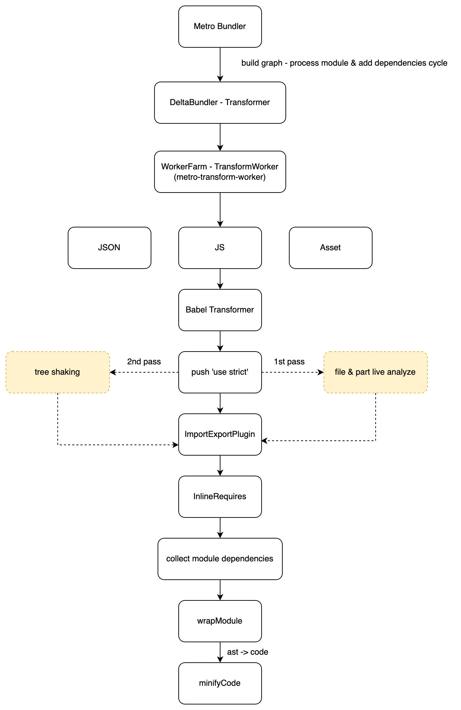
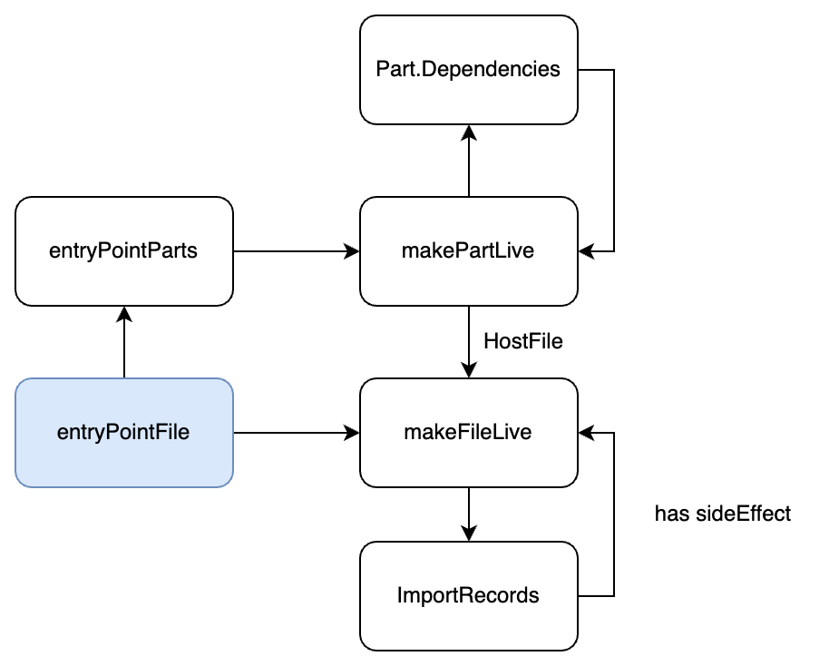
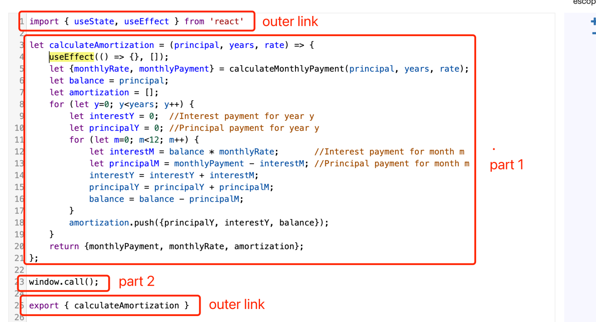

# Find the way to support tree shaking in metro

# The Prior of Art

## Esbuild or Webpack Tree Shaking Solution

### rnx-kit tradeoff

rnx-kit disables the import & export transformation and uses esbuild to build jsbundle to make use of the tree shaking function from esbuild. But it also breaks the original format from metro and loses the future bundle splitting function because esbuild hasn't supported splitting currently, especially commonjs. ([Source](https://github.com/evanw/esbuild/pull/3302))

#### disableImportExportTransform

##### metro-react-native-babel-preset

```javascript
if (!options || !options.disableImportExportTransform) {
  extraPlugins.push(
    [require('@babel/plugin-proposal-export-default-from')],
    [
      require('@babel/plugin-transform-modules-commonjs'),
      {
        strict: false,
        strictMode: false, // prevent "use strict" injections
        lazy: options && options.lazyImportExportTransform != null
          ? options.lazyImportExportTransform
          : importSpecifier => lazyImports.has(importSpecifier),
        allowTopLevelThis: true, // don't rewrite global `this` -> `undefined`
      },
    ],
  );
}
```

##### @babel/plugin-proposal-export-default-from

Compile `export default` to es5

```javascript
export v, { x, y as w } from "mod";
export { default as v, x, y as w } from "mod";
```

##### @babel/plugin-transform-modules-commonjs

- **Named exports**

  ```javascript
  export {foo} from "foo";
  "use strict";

  Object.defineProperty(exports, "__esModule", {
    value: true
  });

  exports.foo = void 0;
  var _foo = require("foo");
  exports.foo = _foo.foo;
  ```

- **Exports**

  ```javascript
  export * from "foo";
  "use strict";

  Object.defineProperty(exports, "__esModule", {
    value: true
  });

  var _foo = require("foo");
  Object.keys(_foo).forEach(function (key) {
    if (key === "default" || key === "__esModule") return;
    if (key in exports && exports[key] === _foo[key]) return;
    exports[key] = _foo[key];
  });
  ```

### Metro Build Graph



#### ImportExportPlugin

Collect and remove origin ExportAllDeclaration, ExportDefaultDeclaration, ExportNamedDeclaration, and ImportDeclaration, then insert the replaced import/export declaration to the file.

#### Testcases

```javascript
// original
import v from 'foo';
import * as w from 'bar';
import {x} from 'baz';
import {y as z} from 'qux';
import 'side-effect';

// transformed
var v = _$$_IMPORT_DEFAULT('foo');
var w = _$$_IMPORT_ALL('bar');
var x = require('baz').x;
var z = require('qux').y;
require('side-effect');
```

- **Dependency ID Mapping**

  ```text
  > 2 | import v from 'foo';
    | ^^^^^^^^^^^^^^^^^^^^ dep #0 (foo)
  > 3 | import * as w from 'bar';
    | ^^^^^^^^^^^^^^^^^^^^^^^^^ dep #1 (bar)
  > 4 | import {x} from 'baz';
    | ^^^^^^^^^^^^^^^^^^^^^^ dep #2 (baz)
  > 5 | import {y as z} from 'qux';
    | ^^^^^^^^^^^^^^^^^^^^^^^^^^^ dep #3 (qux)
  > 6 | import 'side-effect';
    | ^^^^^^^^^^^^^^^^^^^^^ dep #4 (side-effect)
  ```

#### InlineRequires

Top-level `require(...)` aliases to enable lazy loading of dependencies.

```javascript
// original
var Foo = require('foo');
f(Foo);
var Bar = require('foo').bar;
g(Bar);
const {Baz} = require('foo');
h(Baz);

// transformed
f(require('foo'));
g(require('foo').bar);
h(require('foo').Baz);
```

### Collect Module Dependencies

Require call has been replaced

```javascript
var _interopRequireDefault = require(_dependencyMap[0]);
var _routes = _interopRequireDefault(require(_dependencyMap[1]));
var _asgard = _interopRequireDefault(require(_dependencyMap[2]));
var _cyanBridge = _interopRequireDefault(require(_dependencyMap[3]));
var _nightcrawler = require(_dependencyMap[4]);
var tracker = _interopRequireWildcard(require(_dependencyMap[5]));
var trackerMeta = _interopRequireWildcard(require(_dependencyMap[6]));
var _reactNative = require(_dependencyMap[7]);
var _multiDataCenter = require(_dependencyMap[8]);
var _auth = _interopRequireDefault(require(_dependencyMap[9]));
var _http = _interopRequireDefault(require(_dependencyMap[10]));
```

### wrapModule

Tree Shaking information is not enough since `wrapModule`, all the export has been wrapped into `__d` closure

```javascript
__d(function (global, _$$_REQUIRE, _$$_IMPORT_DEFAULT, _$$_IMPORT_ALL, module, exports, _dependencyMap) {
  var _interopRequireDefault = _$$_REQUIRE(_dependencyMap[0]);
  var _routes = _interopRequireDefault(_$$_REQUIRE(_dependencyMap[1]));
  var _asgard = _interopRequireDefault(_$$_REQUIRE(_dependencyMap[2]));
  var _cyanBridge = _interopRequireDefault(_$$_REQUIRE(_dependencyMap[3]));
  var _nightcrawler = _$$_REQUIRE(_dependencyMap[4]);
  var tracker = _interopRequireWildcard(_$$_REQUIRE(_dependencyMap[5]));
  var trackerMeta = _interopRequireWildcard(_$$_REQUIRE(_dependencyMap[6]));
  var _reactNative = _$$_REQUIRE(_dependencyMap[7]);
  var _multiDataCenter = _$$_REQUIRE(_dependencyMap[8]);
  var _auth = _interopRequireDefault(_$$_REQUIRE(_dependencyMap[9]));
  var _http = _interopRequireDefault(_$$_REQUIRE(_dependencyMap[10]));
  // ...
});
```

### Metro built-in serializer

#### baseJSBundle

- **input**: entryPoint, preModules, graph, options

  - **entryPoint**
    - Bundle input location

  - **preModules**
    - Allows developer to inject module before the modules transformed from user code. Usually used by polyfills.

  - **graph**
    - Contains dependencies, source, inverseDependencies, output (after babel transform) and path information for each module.

### Esbuild Linker Implementation For Tree Shaking



#### makeFileLiveForTreeShaking & makePartLiveForTreeShaking

```go
func (c *linkerContext) markPartLiveForTreeShaking(sourceIndex uint32, partIndex uint32) {
  file := &c.graph.Files[sourceIndex]
  repr := file.InputFile.Repr.(*graph.JSRepr)
  part := &repr.AST.Parts[partIndex]

  // Don't mark this part more than once
  if part.IsLive {
    return
  }

  part.IsLive = true

  // Include the file containing this part
  c.markFileLiveForTreeShaking(sourceIndex)

  // Also include any dependencies
  for _, dep := range part.Dependencies {
    c.markPartLiveForTreeShaking(dep.SourceIndex, dep.PartIndex)
  }
}

func (c *linkerContext) markFileLiveForTreeShaking(sourceIndex uint32) {
  file := &c.graph.Files[sourceIndex]

  // Don't mark this file more than once
  if file.IsLive {
    return
  }

  file.IsLive = true

  switch repr := file.InputFile.Repr.(type) {
  case *graph.JSRepr:
    // If the JavaScript stub for a CSS file is included, also include the CSS file
    if repr.CSSSourceIndex.IsValid() {
      c.markFileLiveForTreeShaking(repr.CSSSourceIndex.GetIndex())
    }

    for partIndex, part := range repr.AST.Parts {
      canBeRemovedIfUnused := part.CanBeRemovedIfUnused

      // Also include any statement-level imports
      for _, importRecordIndex := range part.ImportRecordIndices {
        record := &repr.AST.ImportRecords[importRecordIndex]
        if record.Kind != ast.ImportStmt {
          continue
        }

        if record.SourceIndex.IsValid() {
          otherSourceIndex := record.SourceIndex.GetIndex()

          // Don't include this module for its side effects if it can be
          // considered to have no side effects
          if otherFile := &c.graph.Files[otherSourceIndex]; otherFile.InputFile.SideEffects.Kind != graph.HasSideEffects && !c.options.IgnoreDCEAnnotations {
            continue
          }

          // Otherwise, include this module for its side effects
          c.markFileLiveForTreeShaking(otherSourceIndex)

        } else if record.Flags.Has(ast.IsExternalWithoutSideEffects) {
          // This can be removed if it's unused
          continue
        }

        // If we get here then the import was included for its side effects, so
        // we must also keep this part
        canBeRemovedIfUnused = false
      }

      // Include all parts in this file with side effects, or just include
      // everything if tree-shaking is disabled. Note that we still want to
      // perform tree-shaking on the runtime even if tree-shaking is disabled.
      if !canBeRemovedIfUnused || (!part.ForceTreeShaking && !c.options.TreeShaking && file.IsEntryPoint()) {
        c.markPartLiveForTreeShaking(sourceIndex, uint32(partIndex))
      }
    }

    // CSS Repr
  }
}
```

### Part Data Structure

Each file is made up of multiple parts, and each part consists of one or more top-level statements. Parts are used for tree shaking and code splitting analysis. Individual parts of a file can be discarded by tree shaking and can be assigned to separate chunks (i.e., output files) by code splitting.

```go
type Part struct {
  Stmts []Stmt
  Scopes []*Scope

  // Each is an index into the file-level import record list
  ImportRecordIndices []uint32

  // All symbols that are declared in this part. Note that a given symbol may
  // have multiple declarations, and so may end up being declared in multiple
  // parts (e.g., multiple "var" declarations with the same name). Also note
  // that this list isn't deduplicated and may contain duplicates.
  DeclaredSymbols []DeclaredSymbol

  // An estimate of the number of uses of all symbols used within this part.
  SymbolUses map[ast.Ref]SymbolUse

  // An estimate of the number of uses of all symbols used as the target of
  // function calls within this part.
  SymbolCallUses map[ast.Ref]SymbolCallUse

  // This tracks property accesses off of imported symbols. We don't know
  // during parsing if an imported symbol is going to be an inlined enum
  // value or not. This is only known during linking. So we defer adding
  // a dependency on these imported symbols until we know whether the
  // property access is an inlined enum value or not.
  ImportSymbolPropertyUses map[ast.Ref]map[string]SymbolUse

  // The indices of the other parts in this file that are needed if this part
  // is needed.
  Dependencies []Dependency

  // If true, this part can be removed if none of the declared symbols are
  // used. If the file containing this part is imported, then all parts that
  // don't have this flag enabled must be included.
  CanBeRemovedIfUnused bool

  // This is used for generated parts that we don't want to be present if they
  // aren't needed. This enables tree shaking for these parts even if global
  // tree shaking isn't enabled.
  ForceTreeShaking bool

  // This is true if this file has been marked as live by the tree shaking
  // algorithm.
  IsLive bool
}
```

#### Implementation

##### File & Part Live Analysis

- **1st Pass**
  
  - `escope` (scope objects analysis)
  - Get File Parts after babel transformer (Top-Level Declarations & ExpressionStatement in module file)
  - Build Live Part Graph for each file

  
  
  ```text
  part1.dependency = reactDep.useEffectExport.dependency
  calculateAmortizationExport.dependency = part1
  ```

  - Get the filePath of dependencies, it can be got after serializer
  - Calculate LivePart from entryPoint

- **2nd Pass**

  - Remove UnLiveParts
